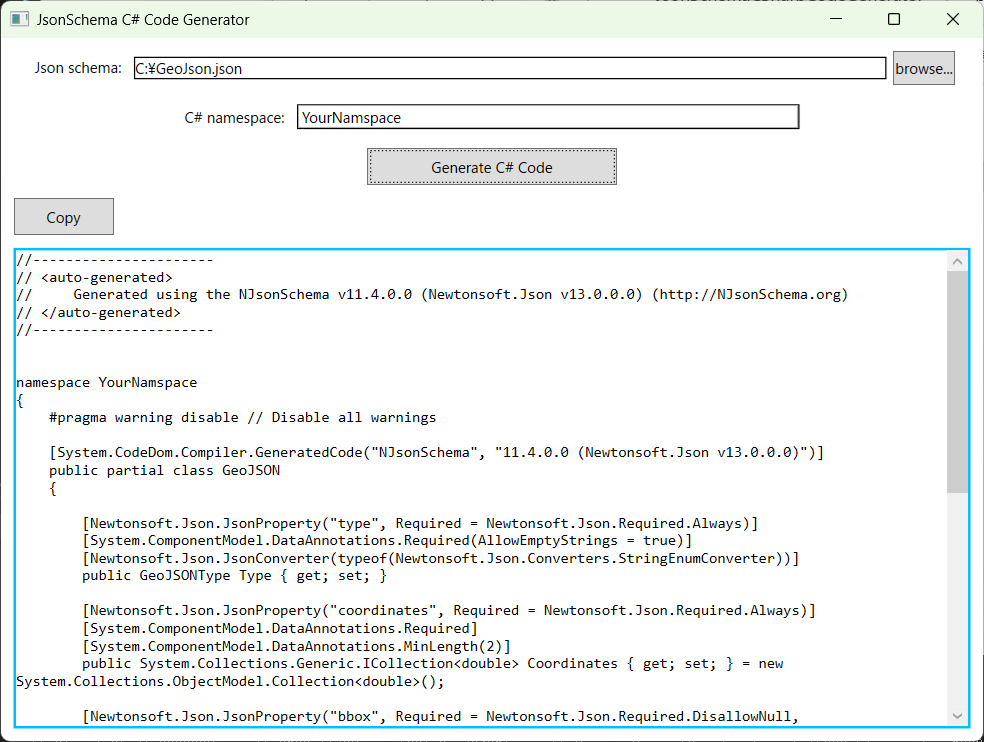

# Windows application that generates C# code from Json schema file using [NJsonSchema](https://github.com/RicoSuter/NJsonSchema).

## Environment
| Item | Description |
|---|---|
| Framework | .NET Framework 4.8.1 |
| Application type | WPF |